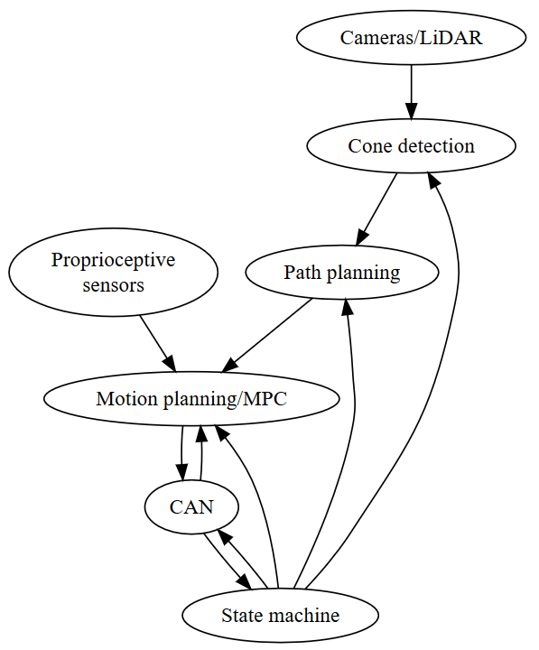

.. DV ROS DOCS documentation master file, created by
   sphinx-quickstart on Wed Jan 29 12:54:10 2020.
   You can adapt this file completely to your liking, but it should at least
   contain the root `toctree` directive.

Welcome to DV ROS documentation!!
=======================================

.. toctree::
   :maxdepth: 2
   :caption: Contents:

   topics

   packages/common
   packages/asm

Indices and tables
==================

* :ref:`genindex`
* :ref:`modindex`
* :ref:`search`
